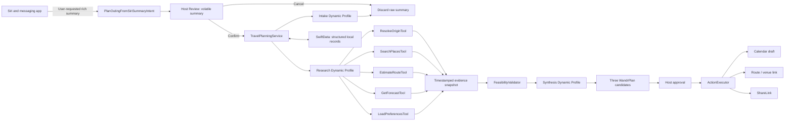

# Wandr AI Integration Blueprint

## Architecture Decision

Wandr replaces the original hackathon idea of autonomous Coordinator, Research, Booking, Payment, and Group agents with a single, bounded iOS planning system.

The system accepts a Siri-mediated summary only after the host asks for the handoff. It turns that summary into a source-backed outing plan, while keeping planning, approval, native handoff, and privacy boundaries independently verifiable.

| Original idea | Concrete iOS 27 capability | V1 result |
| --- | --- | --- |
| Conversation coordinator | `PlanOutingFromSiriSummaryIntent` + Host Review | Receives only a user-requested summary; never reads messages |
| Multi-agent planner | `TravelPlanningService` with Dynamic Profiles | One coordinator, clear state transitions, visible orchestration |
| Research agent | MapKit, Core Location, WeatherKit, preferences, validator tools | Grounded venue, route, forecast, and constraint evidence |
| Logistics agent | Deterministic `FeasibilityValidator` | Feasible timing, route, budget, group, and accessibility checks |
| Booking/calling agent | `ActionExecutor` | Presents a user-approved link or system UI; no autonomous commitment |
| Group polling agent | Deferred | Host shares the approved plan manually; no participant tracking or votes |
| Travel planner | Shared `PlanKind.trip` pipeline | Second hero experience using the same safe architecture |

## Component Diagram



## Interface Boundaries

All boundaries use `Sendable` value types. SwiftData models mirror persisted values but do not cross into actor-isolated planning code.

| Interface | Owns | Requirements |
| --- | --- | --- |
| `TravelPlanningService` | Run lifecycle, profile transitions, cancellation, research orchestration, plan revisions | Actor-isolated; exposes UI-safe snapshots and never receives direct chat data |
| `TravelDataProvider` | Place, route, forecast, and optional origin data | Returns compact, typed evidence plus provenance/availability; no side effects |
| `FeasibilityValidator` | Hard-constraint validation and candidate ranking | Pure deterministic Swift; never calls a model or network service |
| `PreferenceStore` | Local opt-in preference facts | No raw summary, transcript, implicit preference, or remote sync |
| `ActionExecutor` | Approved foreground actions | Accepts immutable proposal IDs from an approved revision only |
| `PlanningRunStore` | Structured local persistence and deletion | Stores minimal records and supports full local erase |

## Proposed Domain Model

| Type | Purpose | Retention and invariants |
| --- | --- | --- |
| `PlanKind` | `.outing` or `.trip` | Establishes UI copy and validator policy; Outings is default |
| `OutingBrief` | Confirmed outing type, timing, area, group, budget, hard/soft constraints, confidence flags | Never contains the raw Siri summary; every inferred field is host-editable |
| `TravelConstraints` | Normalized rules for timing, budget, transport, accessibility, diet, weather, and reserve buffers | Records field source: host, accepted preference, or safe default |
| `GroundedOption` | Candidate venue/activity/route with evidence ID | Requires provider name, retrieval time, availability state, and source URL when available |
| `WandrPlan` | Immutable plan revision with stops, legs, warnings, alternatives, rationale, and evidence IDs | Editing produces a new `PlanRevision`; approved revision never mutates |
| `PlanRevision` | Links a plan to its parent and reason for replan | Carries changed constraints and stale-evidence markers |
| `PlanningRun` | One coordinator state machine instance | Contains run state, events, current revision ID, cancellation handle, and volatile data only |
| `ActionProposal` | One host-readable calendar, route, link, call, or share handoff | Must reference a current approved revision and explicit host selection |
| `PlanningEvent` | Transparency event for tool use, limitations, state transitions, and retries | Contains no chain-of-thought, raw summary, transcript, or participant data |

### Summary-source audit record

The only intake audit data is: `source = siriMediatedSummary`, handoff timestamp, whether the host confirmed/cancelled, and whether the raw content was discarded. It deliberately excludes summary text, source-chat identifier, sender, participant, phone number, and message ID.

## Tool Catalog and Policies

Foundation Models has role-scoped, read-only tools during research. Tool names/descriptions are concise; each returns a bounded typed result rather than arbitrary provider payloads.

| Tool | Inputs | Output | Policy |
| --- | --- | --- | --- |
| `ResolveOriginTool` | Host-selected location mode, manual area | Coordinate/area plus precision and authorization state | Never prompts silently; manual entry is always valid |
| `SearchPlacesTool` | Area, activity/venue category, hard constraints, bounded count | `GroundedOption` candidates | Timestamp and source required; no claim that a venue is bookable |
| `EstimateRouteTool` | Ordered endpoints, travel mode, departure window | Duration, distance, route metadata | Uses returned estimate only; no side effect |
| `GetForecastTool` | Coordinate and time window | Minimal forecast suitability snapshot | Optional; returns explicit unavailable state |
| `LoadPreferencesTool` | Requested preference categories | Accepted local facts | Cannot return raw summaries or unaccepted model inferences |
| `ValidateItineraryTool` | Evidence IDs and `TravelConstraints` | Feasible sequences, violations, warnings | Deterministic and read-only; no network or model call |

### Research requirement

The research profile must use live research tools before generating factual recommendations. A model may organize evidence and explain tradeoffs, but cannot invent venues, availability, route duration, price, forecast, or a booking result. Any failed tool produces a `PlanningEvent` and an explicit limitation in the candidate plan.

### Action boundary

No Foundation Models profile receives an action-capable tool. After host approval, `ActionExecutor` verifies all of the following:

1. the proposal belongs to the exact approved `PlanRevision`;
2. the host explicitly tapped that proposal in the foreground;
3. its destination is present, displayable, and passes a local URL/phone policy;
4. the action maps to an allowed system UI, route, URL, call handoff, or `ShareLink`;
5. the result is persisted as presented, cancelled, unsupported, or failed—never assumed externally complete.

Allowed proposal kinds are `calendarDraft`, `openRoute`, `openBookingURL`, `openPhoneLink`, and `sharePlan`. Payments, booking submission, automatic calling, and automatic messaging do not exist in v1.

## Data Flow and Retention

```mermaid
sequenceDiagram
    participant H as Host
    participant S as Siri / messaging app
    participant I as Wandr App Intent
    participant C as Coordinator
    participant T as Read-only tools
    participant V as Validator
    participant D as SwiftData
    H->>S: Ask for summary and Wandr outing plan
    S->>I: User-requested AttributedString summary
    I->>H: Show summary + extracted constraints for review
    H->>I: Confirm
    I->>C: Structured OutingBrief; discard raw summary
    C->>D: Read accepted preferences only
    C->>T: Research places, routes, forecast in parallel
    T-->>C: Evidence or visible limitation
    C->>V: Validate hard constraints
    V-->>C: Feasible candidates + warnings
    C->>H: Three editable, grounded WandrPlan options
    H->>C: Approve one revision and selected proposals
    C->>D: Persist revision and immutable approval record
    C->>H: Present selected native handoff
```

### Local persistence policy

- Raw Siri `AttributedString` content is held only for Host Review and is cleared on confirmation or cancellation.
- Persist structured briefs, plan revisions, evidence metadata, warnings, immutable approvals, handoff state, and opt-in preferences only.
- Store provenance with every evidence item: provider, retrieval timestamp, evidence ID, source URL/attribution where available, and availability state.
- Preference memory starts off. A host must explicitly accept each saved fact; facts are editable and deletable.
- There is no CloudKit sync, account, backend, analytics pipeline, embedding store, contact store, conversation archive, or location history in v1.

## User-visible Fallbacks

| Condition | What the host sees | System behavior |
| --- | --- | --- |
| Siri supplies no summary | “Ask Siri to send the summary to Wandr again.” | No extraction, research, or manual chat-import fallback |
| Summary is empty/unusable | Same recovery with a concise explanation | Clear volatile data; do not persist it |
| Host rejects summary | Return to Await Siri Summary | Discard summary and make no lookup |
| Foundation Models unavailable | Availability explanation and retained host-review state | No external-model fallback or fabricated plan |
| PCC unavailable | Continue with `SystemLanguageModel` | Preserve structured constraints and evidence policy |
| Location denied/approximate | Manual city/neighborhood control | Do not reprompt automatically |
| Search/route/forecast failure | Timeline limitation and retry/replan control | Keep valid evidence from other tools |
| Validator finds no feasible plan | Constraint conflicts and editable chips | Never stream an impossible itinerary as valid |
| Calendar/link/share cancelled | That proposal shows cancelled | Keep approved plan and other proposals available |

## Implementation-Phase Checklist

This is a planning checklist only; no product code is implied by this document.

### Phase 1 — Trusted intake and local domain

- Define the domain types and `PlanningRun` state machine above.
- Add the foreground authenticated `PlanOutingFromSiriSummaryIntent` with rich summary input and missing-summary recovery.
- Build Host Review, constraint chips, volatile raw-summary deletion, and minimal summary-source audit metadata.
- Make Outings the default tab; retain Trips as a separate `PlanKind` on the shared pipeline.

### Phase 2 — Grounded orchestration

- Add Foundation Models `@Generable` extraction with Dynamic Profiles and injection-resistant instructions.
- Implement read-only MapKit, optional location, WeatherKit, preferences, and deterministic validation providers.
- Render a visible `PlanningEvent` timeline, evidence cards, feasibility warnings, and exactly three grounded candidates.
- Add replan rules that invalidate only stale evidence and preserve host-confirmed constraints.

### Phase 3 — Approval and handoff

- Persist immutable approvals before `ActionExecutor` runs.
- Add calendar draft, route, safe booking/call link, and `ShareLink` proposals behind separate host taps.
- Do not add polling, Messages/WhatsApp extensions, cloud sync, participant identities, bookings, payments, or automatic calls.

### Phase 4 — Evaluation and demo readiness

- Add sanitized after-office, birthday, and full-day Siri-summary fixtures to `WandrTests`.
- Test intent `AttributedString` input, empty recovery, approval gating, non-persistence, extraction, evidence use, replan, and share output.
- Add Foundation Models evaluations for tool trajectories, evidence IDs, source freshness, tool/PCC/model failure, validation warnings, and injection resistance.
- Preflight the Siri phrase and real messaging-app handoff on the physical iOS 27 judging device; preserve the recovery path if the system cannot provide summary content.

## V1 Non-goals

- Direct WhatsApp, iMessage, Messages, contact, or participant access.
- Mock Squad Chat or any local transcript substitute.
- Group polling, vote tracking, delivery receipts, participant identity, or a Messages extension.
- Payments, bill splitting, autonomous bookings, booking confirmation claims, automatic calls, or automatic messages.
- Background location tracking, geofencing, background planning, CloudKit sync, accounts, backend storage, server LLM/API keys, Gemini, LangChain, or custom Foundation Models adapters.

## Sources

- [Apple: Foundation Models](https://developer.apple.com/documentation/foundationmodels/)
- [Apple: Tool protocol](https://developer.apple.com/documentation/foundationmodels/tool)
- [Apple: Expanding generation with tool calling](https://developer.apple.com/documentation/foundationmodels/expanding-generation-with-tool-calling)
- [Apple: App Intents](https://developer.apple.com/documentation/appintents)
- [Apple: Integrating your messaging app with Apple Intelligence](https://developer.apple.com/documentation/appintents/integrating-your-messaging-app-with-apple-intelligence)
- [Apple: App Shortcuts HIG](https://developer.apple.com/design/human-interface-guidelines/app-shortcuts)
- [Apple: MapKit](https://developer.apple.com/documentation/mapkit)
- [Apple: WeatherKit](https://developer.apple.com/documentation/weatherkit)
- [Apple: Evaluating tool-calling behavior](https://developer.apple.com/documentation/Evaluations/evaluating-tool-calling-behavior)
- [Google Cloud: grounded agentic travel architecture](https://docs.cloud.google.com/architecture/agentic-ai-system-with-grounding-using-maps)
- [TravelAgent research paper](https://arxiv.org/abs/2409.08069)
