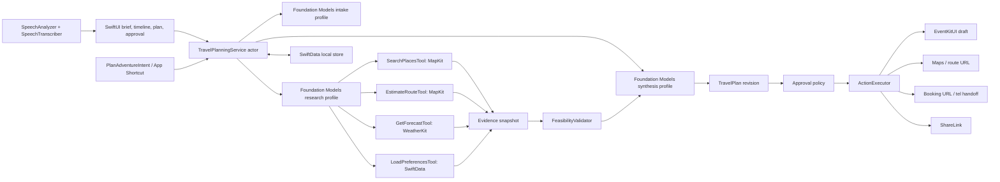
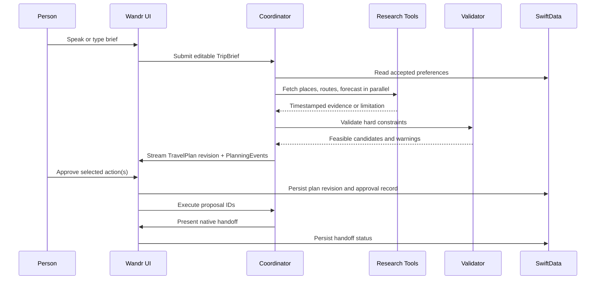

# Wandr AI Integration Blueprint

## Architecture Decision

The original Wandr idea described a Coordinator, Research, Booking, Payment, and Logistics agent. In v1 those agent labels become **bounded iOS capabilities**, not independent autonomous workers.

This preserves the “AI travel execution butler” magic while making the app credible:

- Foundation Models coordinates typed work and explains the result.
- Native system frameworks provide current, attributable data and user-owned handoffs.
- Deterministic code owns feasibility, approval, persistence, and all side effects.
- The person remains in control of any commitment.

## Original Idea to iOS 27 Mapping

| Original agent | V1 capability | Implementation owner | V1 result |
| --- | --- | --- | --- |
| Coordinator | `TravelPlanningService` orchestration actor | Foundation Models profiles plus state machine | Runs the correct phase and exposes progress |
| Research | Read-only evidence tools | MapKit, WeatherKit, local preferences | Current place, route, weather, and preference evidence |
| Logistics | Feasibility validator | Pure Swift deterministic service | Time/budget/route-valid stop sequence |
| Booking | Action proposal and native handoff | `ActionExecutor` | Booking URL or call handoff after confirmation |
| Payment | Explicit non-goal | None | No payment collection, splitting, or UPI/Razorpay integration |
| Group coordinator | Shareable selected itinerary | `ShareLink` | Person-controlled summary sharing |
| Live agent dashboard | `PlanningEvent` timeline | SwiftUI observes run state | Visible status, source, limitation, and retry history |

## Component Diagram

## Domain Model

All domain values crossing actor and framework boundaries are `Sendable` structs/enums. Persistence models mirror these values but do not leak SwiftData objects across actors.

### `TripBrief`

The person’s normalized request. It contains the source text, optional selected origin/destination, requested time window, group and budget semantics, hard constraints, soft preferences, and missing-field list. It never treats model-inferred facts as confirmed hard constraints.

### `TravelConstraints`

The explicit rules used by the validator: start/end time, budget amount and currency/scope, group size, transport, maximum travel duration, dietary/accessibility requirements, required/forbidden categories, and reserve-time policy. Each constraint carries `source` (`person`, `savedPreference`, or `default`) so the UI can explain and edit it.

### `GroundedOption`

A candidate stop or route option derived from a tool. It includes a stable evidence ID, provider name, title, coordinate/endpoints, selected attributes, source URL if available, retrieval timestamp, and confidence/availability state. Raw tool payloads are not put into model prompts or stored indefinitely.

### `TravelPlan`

An immutable revision containing plan title, stops, travel legs, budget assumptions, warnings, alternatives, rationale, evidence IDs, and a source-generation timestamp. It is editable by producing a new revision, never by mutating the approved revision.

### `ActionProposal`

An explicit, user-readable action tied to one approved plan revision. It has an ID, action kind, display label, destination data, preconditions, a risk label, and status. Allowed kinds are `calendarDraft`, `openRoute`, `openBookingURL`, `openPhoneLink`, and `sharePlan`.

### `PlanningEvent`

The timeline record for every meaningful orchestration change: phase, status, title, detail, source/tool name, timestamp, related evidence ID, and retryability. It is a transparency record, not hidden chain-of-thought storage.

## Service Interfaces

These are the implementation boundaries; concrete types are injected to enable real-system and deterministic-test providers.

| Interface | Responsibility | Rules |
| --- | --- | --- |
| `TravelPlanningService` | Owns run state, sessions, cancellation, profile selection, and revision creation | Actor-isolated; emits UI-safe snapshots only |
| `TravelDataProvider` | Supplies place, route, forecast, and location data | Returns typed evidence plus timestamp/source metadata |
| `PreferenceStore` | Reads/writes opted-in local preference facts | Never persists an inference without explicit acceptance |
| `FeasibilityValidator` | Validates candidates against hard constraints | Pure deterministic logic; no model or network work |
| `ActionExecutor` | Presents native side-effect handoffs | Accepts only immutable, approved action proposals |
| `PlanningRunStore` | Saves local drafts, plan revisions, events, and approval audit | Stores minimal data; supports deletion |

## Tool Catalog and Policies

### Read-only Foundation Models tools

| Tool | Inputs | Output | Policy |
| --- | --- | --- | --- |
| `ResolveOriginTool` | Person-selected location mode | Manual/authorized origin and precision state | No silent location authorization request |
| `SearchPlacesTool` | Category, area, constraints, result limit | Candidate `GroundedOption`s | Bounded result count and timestamp required |
| `EstimateRouteTool` | Ordered endpoints and travel mode | Duration, distance, route metadata | No claims beyond returned estimate |
| `GetForecastTool` | Coordinate and time window | Minimal forecast constraint snapshot | Optional; returns an explicit unavailable state |
| `LoadPreferencesTool` | Requested preference categories | Accepted local preference facts | No raw conversation history or unaccepted inferences |
| `ValidateItineraryTool` | Candidate evidence IDs plus constraints | Feasible sequence and violations | Deterministic service; no network or side effect |

Tool argument types are small `@Generable` structures with short descriptions. Their outputs are source-backed and compact enough to preserve model context. Each tool translates unavailable authorization, empty search, stale response, or request failure into a typed limitation.

### Action policy

Action tools are deliberately **not** added to a Foundation Models session. Instead, the approval screen creates `ActionProposal`s and the deterministic executor verifies all of the following before handoff:

1. The proposal belongs to the current, approved plan revision.
2. The person explicitly selected the action.
3. The proposal’s destination still satisfies a local allowlist and has a displayable destination/phone number.
4. The app presents the corresponding system UI or URL action from the foreground.
5. The result is recorded as completed, cancelled, unsupported, or failed without claiming external completion it cannot observe.

This isolates model output from sensitive effects. A plan can recommend “open this restaurant’s booking page,” but cannot represent that a table was booked.

## Data Flow and Persistence

### Local memory policy

- Preference memory is off until a person enables it or explicitly accepts a suggested fact.
- A suggestion is phrased as a choice, for example: “Save that you prefer vegetarian food?”
- Accepted preferences are editable facts, not opaque embeddings or model training data.
- Deleting a preference immediately removes it from future tool responses; deleting a trip removes its local planning history and approval record.
- The initial app has no account, no cloud sync, no cross-device sharing of data, and no remote analytics requirement.

## User-visible Fallbacks

| Condition | User experience | Coordinator behavior |
| --- | --- | --- |
| Microphone/speech unavailable | Editable text remains active | Skip transcription and continue |
| Location denied or approximate | Manual destination picker with explanation | Do not retry the permission prompt automatically |
| Map/place search empty | Show nearby/category alternatives and refine brief | Return typed no-results evidence |
| Weather unavailable | Mark outdoor decision unverified and show alternative | Continue without forecast tool result |
| Foundation Models unavailable | Manual planning/search entry state | Do not construct a session |
| PCC unavailable | Continue with local system model | Do not change approved data |
| Tool error | Visible timeline limitation and retry control | Preserve draft and evidence from other tools |
| Model refusal/parsing error | Explain that Wandr cannot complete that generation | Allow edited retry or manual route/search |
| Calendar/URL handoff cancelled | Mark only that proposal cancelled | Keep the approved plan intact |

## Implementation Phases

### Phase 1 — Trustworthy planning core

1. Replace the template `Item` model with local trip, plan, event, approval, and preference persistence.
2. Implement typed brief intake, text-first UI, and the `PlanningRun` state machine.
3. Add MapKit place/route evidence and deterministic feasibility validation.
4. Add on-device Foundation Models intake and synthesis with required availability/error states.
5. Render source cards, plan warnings, cancellation, and plan revision flow.

### Phase 2 — Native iOS 27 differentiation

1. Add `SpeechAnalyzer`/`SpeechTranscriber` with text fallback.
2. Add WeatherKit constraints and attribution.
3. Add the `PlanAdventureIntent` and App Shortcut.
4. Add EventKitUI calendar draft, Maps/booking/call handoffs, and ShareLink.
5. Enable PCC only after its current capability prerequisites are verified on the target device.

### Phase 3 — Evaluation and judging polish

1. Add deterministic providers and Foundation Models Evaluations datasets.
2. Test expected tool trajectories, unsafe requests, source freshness, model availability, and approval gating.
3. Add a local-only Live Activity for visible planning/replanning progress only after the core path is stable.
4. Build three reliable demo briefs with preflighted locations, permissions, and model availability.

## V1 Non-goals

- Payments, bill splitting, UPI/Razorpay, or financial credential handling.
- Autonomous restaurant/hotel/flight bookings or claims of completed reservations.
- Automatic phone calls, messages, WhatsApp integration, or contact access.
- Background location tracking, geofencing, or proactive rebooking.
- Cloud sync, accounts, server storage, server-side analytics, or external LLM providers.
- Custom Foundation Models adapters, custom Core AI models, or generic multi-agent frameworks.

## Sources

- [Apple: Foundation Models](https://developer.apple.com/documentation/foundationmodels/)
- [Apple: Expanding generation with tool calling](https://developer.apple.com/documentation/foundationmodels/expanding-generation-with-tool-calling)
- [Apple: Tool protocol](https://developer.apple.com/documentation/foundationmodels/tool)
- [Apple: App Intents](https://developer.apple.com/documentation/appintents)
- [Apple: App Shortcuts HIG](https://developer.apple.com/design/human-interface-guidelines/app-shortcuts)
- [Apple: Evaluating tool-calling behavior](https://developer.apple.com/documentation/Evaluations/evaluating-tool-calling-behavior)
- [Google Cloud: trusted agentic travel architecture](https://docs.cloud.google.com/architecture/agentic-ai-system-with-grounding-using-maps)
- [TravelAgent research paper](https://arxiv.org/abs/2409.08069)
