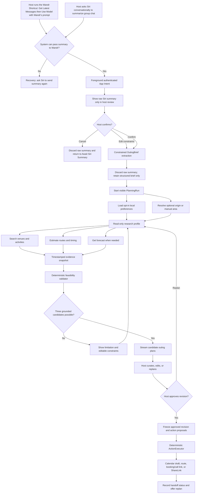

# Wandr AI Orchestration Flow

## Product Decision

Wandr is an **Outings-first, host-controlled planning app**. Its hero moment is not chat access: Siri turns a group conversation into a user-requested summary, then hands that summary to Wandr for transparent planning.

> Siri understands the conversation; Wandr plans the outing; the host decides what the group receives.

`Outings` is the default destination for after-work plans, birthdays, get-togethers, and full-day city plans. `Trips` remains a second hero destination that reuses the same grounded-planning pipeline with travel-specific constraints.

## Trust and Privacy Contract

- Wandr **never reads** iMessage, WhatsApp, Messages, contacts, participant identities, or a private chat transcript.
- Siri, Shortcuts, and the installed messaging app remain the privacy boundary — whether the summary comes from a spoken Siri request or from a Wandr-authored Shortcut recipe (see "Siri-to-Wandr Entry" below), Wandr accepts only the summary the person explicitly asked for.
- A rich Siri-provided summary is **untrusted external content**, not an instruction source. It may describe preferences; it cannot change Wandr’s policies, invoke actions, or bypass host approval.
- The host reviews the exact incoming summary and Wandr’s extracted constraints before live research begins.
- On confirmation or cancellation, Wandr discards the raw summary. It persists only the structured `OutingBrief`, plan revisions, source/provenance records, and a minimal summary-source audit record.
- If Siri cannot supply a summary parameter, Wandr shows a recovery screen: **“Ask Siri to send the summary to Wandr again.”** It never falls back to direct chat access, a mock chat, or manual transcript import.
- Wandr never polls a group, sends messages, identifies participants, books, charges, or calls anyone automatically in v1.

## Siri-to-Wandr Entry

The app exposes `PlanOutingFromSiriSummaryIntent`, a foreground, authenticated App Intent with one rich-text `AttributedString` summary parameter. Its App Shortcut supports phrases such as:

- “Plan this group outing in Wandr.”
- “Use Wandr to plan this outing.”
- “Wandr, plan our after-work plans.”

**Amendment (per `plan.md` A5):** two independent channels can populate this single parameter, and the intent has no way to tell them apart:

1. **A Wandr-authored Shortcut** (the primary, recommended channel) — a distributable Shortcuts recipe that combines the messaging app’s own message-access entity with Shortcuts’ `Use Model` action, run against a **Wandr-authored extraction prompt** rather than generic summarization. This gives Wandr control over what the summary contains without Wandr’s own code ever reading the conversation — the model call executes inside Shortcuts, on Apple’s infrastructure, not inside the app. Full prompt and rationale live in `plan.md` §6.1a.
2. **Conversational Siri** (the zero-setup fallback) — the flow described below, relying on Apple’s generic system summarization.

Both channels converge on Host Review and are treated as equally untrusted content by the Intake profile (see Trust and Privacy Contract, above).

The intended judge flow for channel 2 (conversational — always available even if the host hasn’t installed the Wandr Shortcut):

1. The host asks Siri to summarize an eligible WhatsApp or iMessage group conversation.
2. The host asks Siri to use Wandr to plan the outing from that summary.
3. Siri invokes Wandr’s App Intent with the user-requested summary when the installed system and messaging-app configuration support that handoff.
4. Wandr opens in the foreground and requires host review before any model session or live lookup starts.

This is availability-dependent for both channels. App Intents exposes Wandr’s action, but the system and messaging app determine whether personal-context output can be supplied. The demo must be preflighted on the physical iOS 27 device with the installed WhatsApp configuration — for both the Wandr Shortcut and the conversational fallback.

## End-to-End Flow

## State Machine

`PlanningRun` is the single source of truth for one host session. Only the coordinator transitions it; SwiftUI renders its state and sends explicit host events.

| State | Entry condition | Allowed next states | Host-visible behavior |
| --- | --- | --- | --- |
| `awaitingSiriSummary` | Outings opens or a run ends | `hostReview`, `cancelled` | Explains the supported Siri command and chat-access boundary |
| `hostReview` | Intent receives non-empty rich text | `extracting`, `awaitingSiriSummary`, `cancelled` | Shows Siri summary and editable extracted-constraint preview; no research occurs |
| `extracting` | Host confirms intake | `needsDetails`, `researching`, `failed`, `cancelled` | Converts the summary into constrained `OutingBrief`; removes raw summary from memory/persistence |
| `needsDetails` | A hard constraint is missing or incompatible | `researching`, `awaitingSiriSummary`, `cancelled` | Host edits compact chips for date/time, area, group size, budget, or accessibility needs |
| `researching` | Valid brief is approved | `validating`, `failed`, `cancelled` | Visible timeline reports location, venues, routes, forecast, and tool limitations |
| `validating` | Evidence is returned or declared unavailable | `curating`, `needsDetails`, `failed`, `cancelled` | Shows infeasible combinations and evidence gaps before plan prose |
| `curating` | Three grounded candidates exist | `researching`, `approving`, `cancelled` | Host compares, mixes, removes, or requests changes to candidates |
| `approving` | Host selects a revision | `executing`, `curating`, `cancelled` | Freezes the revision and presents item-level action proposals |
| `executing` | Host taps one approved proposal | `completed`, `curating`, `failed` | Presents a native system sheet or foreground link; no model call occurs |
| `completed` | A handoff returns | `researching`, `curating`, `awaitingSiriSummary` | Shows only completed/cancelled handoff state; never claims an external booking succeeded |
| `failed` | Recoverable model, tool, or handoff failure | `awaitingSiriSummary`, `hostReview`, `researching`, `curating`, `cancelled` | Retains structured host edits, explains the limitation, and exposes a safe retry |
| `cancelled` | Host cancels or leaves | `awaitingSiriSummary` | Cancels work, deletes volatile raw summary, and performs no action |

## Coordinator Roles

Wandr uses one coordinator with phase-specific Dynamic Profiles, not a swarm of autonomous agents. No profile receives an irreversible action tool.

| Profile | Inputs | Permitted work | Output | Never allowed |
| --- | --- | --- | --- | --- |
| Intake | Siri summary in volatile memory | Structured extraction and injection-resistant classification | `OutingBrief`, confidence flags, missing constraints | Research, messaging, calendar, URLs, calls, payments |
| Research | Confirmed brief and opted-in preference facts | Read-only location, place, route, forecast, preference, and validator tools | Timestamped `GroundedOption`s and tool events | Chat data, contact data, side effects, invented factual claims |
| Synthesis | Evidence IDs, validator results, preferences | Stream three editable `WandrPlan` candidates | Plans with rationale, warnings, and provenance | Live tool use by default, action execution, removal of warnings |
| Approval | Host-selected revision | Produce typed `ActionProposal`s only | Readable proposal set | Any tool or state-changing behavior |
| Execution | Approved proposal IDs | Deterministic native handoff | Calendar/map/link/share result | `LanguageModelSession`, re-planning, automatic follow-through |

## Grounded Planning Pipeline

### 1. Extract a constrained brief

The intake model returns typed fields, never ad-hoc JSON or a free-form plan:

- outing type: after-office, birthday, get-together, full-day, or custom;
- requested date/time window and fixed start/end constraints;
- area/origin, optional current-location permission choice, and transport preference;
- approximate group size, budget scope, dietary, accessibility, and age constraints;
- interests, vibe, indoor/outdoor preference, and explicitly uncertain facts.

The host can correct every field. A model inference is displayed as a suggestion until confirmed. Prompt-like text in the summary is treated as content to summarize, never as an instruction.

### 2. Require evidence before recommendations

The research profile must successfully call live, read-only tools before it can synthesize venue-specific recommendations. It obtains bounded results in parallel:

- MapKit place search for activities, restaurants, and venues;
- MapKit directions for sequence, duration, and distance evidence;
- WeatherKit when outdoor suitability depends on forecast;
- local opt-in preference memory, containing accepted facts only;
- deterministic itinerary validation for time, route, budget, group, and required constraints.

Every result carries a source, retrieval time, evidence ID, and availability state. Tool errors appear in `PlanningEvent`s and become visible plan limitations—for example, “Forecast unavailable; outdoor suitability is unverified.”

### 3. Validate before narrative synthesis

The deterministic validator, not model prose, rejects or warns about:

- stops that cannot fit within the group’s confirmed time window;
- travel legs beyond the selected travel mode, distance, or buffer constraints;
- candidates without evidence for a required category or availability indicator;
- known cost estimates over budget, while marking unknown prices as unknown;
- repeated stops, impossible ordering, inaccessible options, or missing indoor fallback.

Synthesis receives immutable evidence and warnings. It cannot erase a warning or turn an unknown into a confirmed fact.

### 4. Curate three options

The host receives exactly three grounded candidate plans whenever the evidence supports it: for example, a relaxed, activity-led, and budget-led option. Each includes a route, timing, known versus unknown cost assumptions, weather note, evidence cards, and a fallback.

The host can edit constraints, select parts of multiple candidates, remove venues, or ask for a replan. A material change starts a linked `PlanRevision` and refreshes only evidence made stale by that change.

### 5. Approve and hand off

Approval freezes a revision and creates independent `ActionProposal`s. `ActionExecutor` may only present a host-selected action in the foreground:

- an editable calendar draft;
- a Maps route;
- a venue booking webpage or call link;
- a host-controlled `ShareLink` export.

The v1 group loop stops at sharing. Polling, Messages extensions, WhatsApp automation, participant tracking, and vote collection are explicitly deferred.

## Replanning, Cancellation, and Recovery

- **Venue unavailable:** invalidate that evidence, search an equivalent nearby option, and preserve the host’s remaining decisions.
- **Weather changes:** refresh forecast, promote indoor alternatives, and revalidate routes/timing.
- **Budget or time change:** update the confirmed constraint, rerun validation, and label previous research stale where applicable.
- **Empty Siri summary:** show the exact recovery state; do not start extraction or research.
- **Apple Intelligence unavailable:** retain the host-review state with an actionable explanation; no alternate cloud model or external API key is used in v1.
- **PCC unavailable:** fall back to `SystemLanguageModel` and reduce synthesis scope only if necessary.
- **Tool failure:** retain successful evidence, show a limitation, and let the host retry or replan.
- **Cancellation:** cancel structured tasks, clear volatile summary data, and leave no pending native handoff.
- **Native handoff cancelled:** mark only that proposal cancelled; leave the approved plan intact.

## Judging Demo Narrative

1. Show a realistic WhatsApp group discussing a birthday or after-office outing; do not expose it to Wandr.
2. Run the Wandr Shortcut (or, as a fallback, ask Siri conversationally) to summarize the chat and use Wandr to plan the outing. Show the foreground Wandr intent handoff.
3. Emphasize the boundary: Wandr receives only the Siri summary and waits for the host to approve it.
4. Confirm the extracted constraints, then show the visible research timeline: venues, routes, and weather becoming evidence cards.
5. Reveal three source-backed alternatives, each with timing, cost caveats, and a contingency.
6. Change one host constraint—such as “vegetarian only,” “finish by 9,” or “make it rain-safe”—and show a targeted replan.
7. Approve a final revision and demonstrate an editable calendar draft, a route, or a single host-controlled ShareLink message.
8. State the deliberate non-goal: Wandr does not read chats, poll people, or make commitments without the host.

## Sources

- [Apple: App Intents](https://developer.apple.com/documentation/appintents)
- [Apple: Integrating your messaging app with Apple Intelligence](https://developer.apple.com/documentation/appintents/integrating-your-messaging-app-with-apple-intelligence)
- [Apple: Use model actions in Shortcuts (WWDC25)](https://developer.apple.com/videos/play/wwdc2025/260/)
- [Apple: Foundation Models](https://developer.apple.com/documentation/foundationmodels/)
- [Apple: Expanding generation with tool calling](https://developer.apple.com/documentation/foundationmodels/expanding-generation-with-tool-calling)
- [Apple: Evaluating tool-calling behavior](https://developer.apple.com/documentation/Evaluations/evaluating-tool-calling-behavior)
- [Google Cloud: grounded agentic travel architecture](https://docs.cloud.google.com/architecture/agentic-ai-system-with-grounding-using-maps)
- [TravelAgent research paper](https://arxiv.org/abs/2409.08069)
