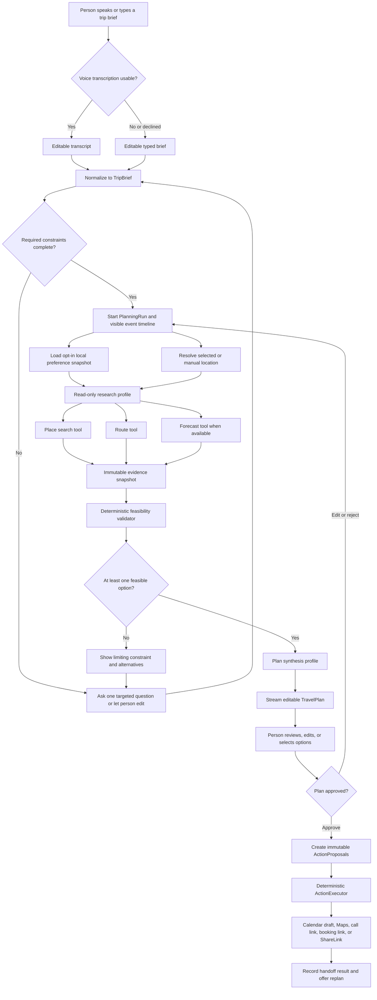

# Wandr AI Orchestration Flow

## Purpose

Wandr turns a spontaneous travel brief into a **grounded, editable, and safely actionable** mini-itinerary. It is not a chatbot that invents places or a fully autonomous booking system. The v1 product promise is:

> Speak or type what the group wants. Wandr researches the live situation, builds a feasible plan, explains its evidence, and performs only the native handoffs the group explicitly approves.

The app is local-first on iOS 27. Apple Foundation Models interprets, coordinates, and presents information; trusted system frameworks provide the facts and deterministic code decides whether a plan is feasible.

## Product Contract

### Inputs

- A spoken brief transcribed on device, with editable text as an equal first-class alternative.
- Optional current location, requested only when the person chooses **Use my location**.
- The person can instead enter a destination manually at any time.
- A locally stored, editable preference profile is used only when the person has opted in to saved preferences.

### Outputs

- A source-backed itinerary with places, route estimates, forecast constraints, budget assumptions, and timing.
- A transparent event timeline that shows what Wandr is doing and the source or limitation behind each step.
- A set of independent `ActionProposal`s: add itinerary to Calendar, open a route, open a venue booking page, start a phone call, or share the itinerary.

### Non-negotiable safety rules

1. The model has no payment, booking, messaging, or automatic-call tool.
2. Read-only research tools return live data before factual recommendations are synthesized.
3. Deterministic validation, not model prose, decides whether route, time, and budget constraints are satisfied.
4. Every external handoff requires a tap on that specific approved action.
5. The app never claims that a reservation, payment, or call completed unless the operating system or an integrated provider confirms it.

## End-to-End Flow

## State Machine

`PlanningRun` is the single source of truth for a planning session. Only the coordinator may transition its state; the UI renders state and sends intent events.

| State | Entry condition | Allowed next states | Visible experience |
| --- | --- | --- | --- |
| `draftingBrief` | New screen or resumed saved draft | `needsDetails`, `researching`, `cancelled` | Voice affordance, text field, manual destination picker |
| `needsDetails` | Required hard constraint missing or ambiguous | `draftingBrief`, `cancelled` | One concise question and editable chips; never an unbounded questionnaire |
| `researching` | Valid `TripBrief` is submitted | `validating`, `failed`, `cancelled` | Timeline updates for location, places, route, forecast, and preferences |
| `validating` | Research tools return snapshots or declared limitations | `synthesizing`, `needsDetails`, `failed`, `cancelled` | Constraint warnings and alternatives appear before a plan is promised |
| `synthesizing` | At least one feasible candidate set exists | `reviewing`, `failed`, `cancelled` | Streaming plan sections with explicit loading placeholders |
| `reviewing` | A complete typed `TravelPlan` exists | `researching`, `approving`, `cancelled` | Source cards, edit controls, selected stops, and action preview |
| `approving` | Person confirms the current revision | `executing`, `reviewing`, `cancelled` | Final summary and item-level action approvals |
| `executing` | At least one `ActionProposal` is approved | `completed`, `reviewing`, `failed` | System handoff sheet or URL action; no model generation occurs |
| `completed` | All requested handoffs returned | `researching`, `reviewing` | Completed/pending action statuses and **Replan** affordance |
| `failed` | A recoverable model/tool/action failure occurs | `draftingBrief`, `researching`, `reviewing`, `cancelled` | Plain-language error, retained user input, and a safe retry path |
| `cancelled` | Person cancels or leaves the run | `draftingBrief` | No pending tool calls or location updates remain |

## Coordinator Profiles and Responsibilities

Wandr uses one `TravelPlanningService` coordinator, not a swarm of independent language-model agents. Specialized roles are created by selecting a tightly scoped Foundation Models Dynamic Profile.

| Profile | Inputs | Available capabilities | Output | Prohibited capabilities |
| --- | --- | --- | --- |
| Intake | transcript or text brief | Structured parsing only | `TripBrief` and missing hard constraints | All research and action tools |
| Research | typed constraints and preference snapshot | Read-only place, route, forecast, and local-preference tools | Grounded candidates and tool events | Calendar, URL opening, calls, sharing, and model-only recommendations |
| Synthesis | immutable evidence snapshot and validator result | No live tools by default | Streamed `TravelPlan` with cited evidence IDs | Any side effect or unsupported factual claim |
| Approval | selected plan and action policy | No model tools | Typed `ActionProposal` set | Side effects and changed plan content |
| Execution | approved action IDs only | Deterministic native system APIs | Handoff result | Any `LanguageModelSession` |

Dynamic Profiles make these capabilities change with application state while retaining the narrow session context needed for a coherent conversation. The model must use a research tool before research-phase generation can complete; the profile switches to an allowed/disallowed tool mode after the required evidence is acquired so it has an exit path.

## Research and Validation Pipeline

### 1. Normalize the request

The intake profile generates a constrained `TripBrief`, never free-form JSON. It extracts:

- Origin or destination and whether current location may be used.
- Time window and fixed arrival/departure constraints.
- Group size, per-person or total budget, and transport preference.
- Hard needs: dietary, accessibility, age, safety, or non-negotiable activity constraints.
- Soft preferences: mood, pace, venue style, food, and interests.

Missing hard facts create `needsDetails`; the app does not guess a date, budget, group size, or city.

### 2. Gather evidence

Independent lookups run concurrently under structured concurrency and return immutable snapshots:

- Place search returns candidate venues/points of interest with MapKit identity, coordinate, category, URL where available, and retrieval timestamp.
- Route estimation returns travel mode, duration, distance, route endpoints, and retrieval timestamp.
- Forecast lookup returns only the fields needed to constrain outdoor choices, with its observation/forecast timestamp and attribution requirement.
- Preference lookup returns local, opted-in preference facts; it never returns raw historical transcripts.

Every failed or unavailable tool produces a `PlanningEvent` and a visible limitation, such as “Weather could not be checked; outdoor stops are marked as unverified.” The model may reason over that limitation but may not silently fill it with world knowledge.

### 3. Validate feasibility deterministically

The validator receives tool snapshots, not the model's prose. It rejects or warns on:

- A stop that cannot fit before the group’s end time when route time and visit duration are included.
- A route that exceeds the selected travel-mode or distance limit.
- A required category, opening-time indication, or forecast constraint with no evidence.
- A known estimated cost total beyond the stated budget, while distinguishing unknown prices from confirmed prices.
- Repeated venues, impossible sequence ordering, or a missing return/reserve buffer.

The validator returns feasible candidate sequences plus machine-readable warnings. Synthesis cannot remove or weaken a warning.

### 4. Synthesize and stream the plan

The synthesis profile receives only:

- The normalized brief.
- The opted-in preference snapshot.
- Feasible routes/stops and their evidence IDs.
- Validator warnings and unknowns.

It streams an editable `TravelPlan`: headline, timed stops, travel legs, budget assumptions, weather notes, rationale, source cards, and alternatives. Partial output stays visibly partial until the final typed response passes local validation.

### 5. Review, approve, and hand off

The person may remove stops, alter time/budget, choose an alternative, or request a replan. Any material edit invalidates research that depends on it and returns the run to `researching`.

Approval freezes the selected plan revision and creates action proposals. `ActionExecutor` then handles only the requested native handoff:

- Present an editable Calendar event using the system event editor.
- Open a MapKit route or venue URL.
- Open a venue booking webpage.
- Request a system phone-call handoff with a visible number.
- Export/share the itinerary through `ShareLink`.

## Replanning

Replanning is a fresh `PlanningRun` linked to the previous run. It copies only the person's still-valid constraints and explicitly selected stops. It does not reuse stale tool output without marking it stale.

### Trigger examples

- “It started raining” refreshes forecast, filters outdoor stops, and recalculates routes.
- “We have one hour less” updates the time window and revalidates the sequence.
- “The cafe is closed” removes that evidence item and searches for a replacement near the preceding stop.
- “Spend less” updates the budget constraint and removes unknown/high-estimate options before synthesis.

## Cancellation and Recovery

- Cancelling a run cancels in-flight structured tasks, ends speech capture, and preserves the editable brief.
- The UI never starts a second response on a session that is already responding.
- Context overflow creates a condensed, typed session summary and a new session; it does not truncate a plan without disclosure.
- Guardrail refusals, unsupported locale, unavailable local model, PCC quota/network failure, and generated-content parsing errors each render a specific recovery action.
- If Apple Intelligence is disabled, assets are unavailable, or the device is not eligible, Wandr continues with manual brief editing and native search/handoff surfaces; it never shows an error wall.
- Location denial is normal: retain typed destination entry and allow map search without current location.
- Calendar or URL handoff cancellation marks only that action as cancelled; the reviewed plan stays intact.

## Judging Demo Script

1. Open Wandr and say: “We’re in Goa, four people, ₹3,000 each, six hours, beach sunset, local food, no long drives.”
2. Show the live transcript and let the judge edit a word to demonstrate reliable text recovery.
3. Show Wandr’s timeline as it uses the selected location, searches places, estimates routes, and checks the forecast.
4. Reveal a short, route-feasible plan whose stops display source cards, times, travel legs, known/unknown costs, and a weather fallback.
5. Change one constraint—“make it vegetarian”—and show the plan re-research rather than hallucinate a replacement.
6. Approve the final plan and demonstrate Calendar draft, route opening, and itinerary sharing. State plainly that reservations and payments remain user-controlled in v1.

## Sources

- [Apple: Foundation Models overview](https://developer.apple.com/documentation/foundationmodels/)
- [Apple: Expanding generation with tool calling](https://developer.apple.com/documentation/foundationmodels/expanding-generation-with-tool-calling)
- [Apple: Evaluating tool-calling behavior](https://developer.apple.com/documentation/Evaluations/evaluating-tool-calling-behavior)
- [Apple: App Intents](https://developer.apple.com/documentation/appintents)
- [Google Cloud: trusted agentic travel architecture](https://docs.cloud.google.com/architecture/agentic-ai-system-with-grounding-using-maps)
- [TravelAgent research paper](https://arxiv.org/abs/2409.08069)
